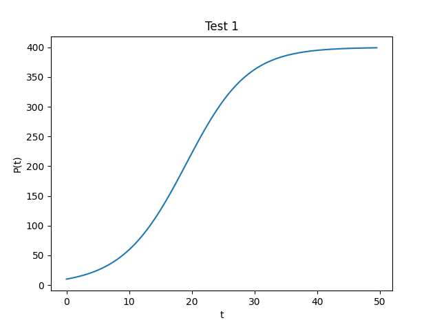

# Software Manual by Kollin Murphy

## Table of Contents

1. [Fixed Point Iteration](#fixed-point-iteration)
2. [Bisection Method](#bisection-method)
3. [Newton's Method](#newtons-method)
4. [Secant Method](#secant-method)
5. [Hybrid Bisection-Newton Method](#hybrid-bisection-newton-method)
6. [Hybrid Bisection-Secant Method](#hybrid-bisection-secant-method)
7. [Second Derivative Approximation](#second-derivative-approximation)
8. [Least Squares Regression](#least-squares-regression)
9. [Explicit Euler Logistic](#explicit-euler-logistic)
10. [Implicit Euler Logistic](#implicit-euler-logistic)


## Fixed Point Iteration

**Routine Name:** `fixedPoint`

**Author:** Kollin Murphy

**Language:** Python3

**Description/Purpose**: The function `fixedPoint` approximates the root of a function given the function, an initial approximation, a tolerance, and the maximum number of iterations. It uses the fixed point iteration algorithm to do so.

#### Usage

The function accepts parameters as follows:

```python
fixedPoint(f, initial_approximation, tolerance, max_iterations)
```

The function returns the approximate root of the function `f` as a float.

Example usage:

```python
from rootFinding import fixedPoint

def f(x):
  return x * pow(e, -x)

print(fixedPoint(f, initial_approximation=0.5, tolerance=0.0000001, max_iterations=1000))
```

Example output:

```
4.676720855835697e-24
```

#### Flags

This command also accepts a verbose flag that is given from the command line with `-v`, `--v`, or `--verbose`.

When verbose mode is enabled, it will output a table of results. From the same example above, it would produce the following table.

```
Iteration    Approx. Root             Abs. Error              
1            0.1967346701436833       0.3032653298563167      
2            0.035135130278937304     0.16159953986474598     
3            0.0012130423916044478    0.03392208788733286     
4            1.4705797257291708e-06   0.0012115718118787186   
5            2.162603139558558e-12    1.4705775631260313e-06  
6            4.676720855835697e-24    2.1626031395538813e-12  
4.676720855835697e-24
```

#### Implementation

`fixedPoint` is implemented as follows:

```python
from math import e
from sys import argv

verbose = False
for arg in argv:
  if arg == '-v' or arg == '--v' or arg == '--verbose':
    verbose = True

def fixedPoint(f, initial_approximation, tolerance, max_iterations):
  error = 10.0 * tolerance
  x0 = initial_approximation
  x1 = 0
  iterations = 0

  def g(x):
    return x - f(x)
  
  if verbose:
    print("{:<12} {:<24} {:<24}".format("Iteration", "Approx. Root", "Abs. Error"))

  while error > tolerance and iterations < max_iterations:
    x1 = g(x0)
    error = abs(x1 - x0)
    x0 = x1
    iterations += 1

    if verbose:
      print("{:<12} {:<24} {:<24}".format(iterations, x0, error))
  return x0
```


## Bisection Method

**Routine Name:** `bisect`

**Author:** Kollin Murphy

**Language:** Python3

**Description/Purpose**: The function `bisect` approximates the root of a function given the function, two endpoints of an interval, and a tolerance. It uses the bisection algorithm to do so.

#### Usage

The function accepts parameters as follows:

```python
bisect(f, a, b, tol)
```

The function returns the root of the function `f` between the endpoints `a` and `b` with a tolerance of `tol`.

Example usage:

```python
from rootFinding import bisect

def f(x):
  return x * pow(e, -x)

print(bisect(f, -1, 2, 0.0001))
```

Example output:

```
3.0517578125e-05
```

#### Flags

This command also accepts a verbose flag that is given from the command line with `-v`, `--v`, or `--verbose`.

When verbose mode is enabled, it will output a table of results. From the same example above, it would produce the following table.

```
Iteration    Approx. Root             Abs. Error              
0            0.5                      1.5                     
1            -0.25                    0.75                    
2            0.125                    0.375                   
3            -0.0625                  0.1875                  
4            0.03125                  0.09375                 
5            -0.015625                0.046875                
6            0.0078125                0.0234375               
7            -0.00390625              0.01171875              
8            0.001953125              0.005859375             
9            -0.0009765625            0.0029296875            
10           0.00048828125            0.00146484375           
11           -0.000244140625          0.000732421875          
12           0.0001220703125          0.0003662109375         
13           -6.103515625e-05         0.00018310546875        
14           3.0517578125e-05         9.1552734375e-05        
3.0517578125e-05
```

#### Implementation

`bisect` is implemented as follows:

```python
from math import ceil, e, log
from sys import argv

verbose = False
for arg in argv:
  if arg == '-v' or arg == '--v' or arg == '--verbose':
    verbose = True

def bisect(f, a, b, tol):
  fa = f(a)
  fb = f(b)

  if fa * fb >= 0:
    raise Exception('Intermediate Value Theorem is not satisfied by the initial conditions')

  k = ceil(-log(tol / (b - a)) / log(2))
  c = a

  if verbose:
    print("{:<12} {:<24} {:<24}".format("Iteration", "Approx. Root", "Abs. Error"))

  for i in range(0, k):
    c = (a + b) / 2
    fc = f(c)
    if fa * fc < 0:
      b = c
      fb = fc
    else:
      a = c
      fa = fc
    if verbose:
      error = abs(a - b)
      print("{:<12} {:<24} {:<24}".format(i, c, error))
  
  return c
```


## Newton's Method

**Routine Name:** `newtons`

**Author:** Kollin Murphy

**Language:** Python3

**Description/Purpose**: The function `newtons` approximates the root of a function given the function, its first-order derivative, an initial approximation, the maximum number of iterations, and a tolerance.

#### Usage

The function accepts parameters as follows:

```python
newtons(function, functionDerivative, initialApproximation, maximumIterations, tolerance)
```

The function returns an approximate root of the given function.

Example usage:

```python
def f(x):
  return x * pow(e, -x)

def fPrime(x):
  return pow(e, -x) - (x * pow(e, -x))

print(newtons(f, fPrime, -3.0, 1000, 0.00001))
```

Example output:

```
-1.3178467639212633e-14
```

#### Flags

This command also accepts a verbose flag that is given from the command line with `-v`, `--v`, or `--verbose`.

When verbose mode is enabled, it will output a table of results. From the same example above, it would produce the following table.

```
Iteration    Approx. Root             Abs. Error              
1            -2.25                    0.75                    
2            -1.5576923076923077      0.6923076923076923      
3            -0.9486697513013304      0.6090225563909774      
4            -0.461840338227204       0.48682941307412636     
5            -0.14590957195262932     0.31593076627457467     
6            -0.018578781178275744    0.12733079077435358     
7            -0.00033887522148356997  0.018239905956792174    
8            -1.1479751370265271e-07  0.0003387604239698673   
9            -1.3178467639212633e-14  1.1479750052418507e-07  
```

#### Implementation

`newtons` is implemented as follows:

```python
from sys import argv

verbose = False
for arg in argv:
  if arg == '-v' or arg == '--v' or arg == '--verbose':
    verbose = True

def newtons(f, fPrime, x, maxIterations, tolerance):
  i = 0
  y = 10.0 * tolerance

  if verbose:
    print("{:<12} {:<24} {:<24}".format("Iteration", "Approx. Root", "Abs. Error"))

  while (abs(y) > tolerance and i < maxIterations):
    y = f(x) / fPrime(x)
    x = x - y
    i += 1
    if verbose:
      print("{:<12} {:<24} {:<24}".format(i, x, abs(y)))
  return x
```


## Secant Method

**Routine Name:** `secant`

**Author:** Kollin Murphy

**Language:** Python3

**Description/Purpose**: The function `secant` approximates the root of a function given the function, two initial approximations, the maximum number of iterations, and a tolerance level.

#### Usage

The function accepts parameters as follows, where `x0` and `x1` are two initial approximations.

```python
secant(function, x0, x1, maximumIterations, tolerance)
```

The function returns an approximate root of the given function.

Example usage:

```python
def f(x):
  return x * pow(e, -x)

print(secant(f, 1, 0.5, 100, 0.00001))
```

Example output:

```
4.039302763706419e-07
```

#### Flags

This command also accepts a verbose flag that is given from the command line with `-v`, `--v`, or `--verbose`.

When verbose mode is enabled, it will output a table of results. From the same example above, it would produce the following table.

```
Iteration    Approx. Root             Abs. Error              
1            -1.8467422493615944      11.706747557360922
2            0.44074231484814863      0.2836434721461853
3            0.3866298123720783       0.2626540759096701
4            -0.2905154076645947      0.3884529365322745
5            0.11347202321181965      0.10129978529945151
6            0.029911813768984136     0.029030346036369014
7            -0.003653989698321175    0.00366736576215364
8            0.00011074097071405798   0.00011072870783047764
9            4.039302763705064e-07    4.039301132108712e-07
```

#### Implementation

`secant` is implemented as follows:

```python
from sys import argv

verbose = False
for arg in argv:
  if arg == '-v' or arg == '--v' or arg == '--verbose':
    verbose = True

def secant(f, x0, x1, maxIterations, tolerance):
  i = 0
  f0 = f(x0)
  f1 = f(x1)

  if verbose:
    print("{:<12} {:<24} {:<24}".format("Iteration", "Approx. Root", "Abs. Error"))

  while (abs(f1) > tolerance and i < maxIterations):
    x2 = x1 - f1 * (x1 - x0)  /(f1 - f0)
    x0 = x1
    x1 = x2
    f0 = f1
    f1 = f(x1)
    i += 1

    if verbose:
      print("{:<12} {:<24} {:<24}".format(i, x1, abs(f1)))
  return x1
```

## Hybrid Bisection-Newton Method

**Routine Name:** `hybrid_newtons`

**Author**: Kollin Murphy

**Language**: Python3

**Description/Purpose**: The function `hybrid_newtons` approximates the root of a function given the function, its first-order derivative, initial lower and upper bounds, the maximum number of iterations, and a tolerance.

#### Usage

The function accepts parameters as follows:

```python
hybrid_newtons(function, functionDerivative, lower, upper, maximumIterations, tolerance)
```

The function returns an approximate root of the given function.

Example usage:

```python
from math import cos, e, pi, sin

def f(x):
  return 10.14 * pow(e, pow(x, 2)) * cos(pi / x)

def fPrime(x):
  return ((1014 * cos(pi / x) * pow(x, 3)) + (507 * pi * sin(pi / x))) * pow(e, pow(x, 2)) / (50 * pow(x, 2))

print(hybrid_newtons(f, fPrime, -3, 7, 10, 0.001))
```

Example output:

```
2.0
```

#### Flags

This command also accepts a verbose flag that is given from the command line with `-v`, `--v`, or `--verbose`.

When verbose mode is enabled, it will output a table of results. A sample output table may look similar to the following.

```
Iteration    Algorithm    Approx. Root             Abs. Error              
0            bisection    -0.06562500000000003     0.19375                 
1            newtons      9.437033465323208e-05    0.06571937033465326     
2            newtons      -2.8014652501007903e-13  9.43703349333786e-05    
3            newtons      0.0                      2.8014652501007903e-13  
0.0
```

#### Implementation

`hybrid_newtons` is implemented as follows:

```python
from sys import argv

verbose = False
for arg in argv:
  if arg == '-v' or arg == '--v' or arg == '--verbose':
    verbose = True

bisection_iterations = 4

def hybrid_newtons(f, fPrime, a, b, maxIterations, tolerance):
  error = 10.0 * tolerance
  i = 0

  if verbose:
    print("{:<12} {:<12} {:<24} {:<24}".format("Iteration", "Algorithm", "Approx. Root", "Abs. Error"))

  x0 = (a + b) / 2
  while (error > tolerance and i < maxIterations):
    x1 = x0 - (f(x0) / fPrime(x0))
    e1 = abs(x1 - x0)

    if (e1 > error):
      fa = f(a)
      for _ in range(bisection_iterations):
        c = (a + b) / 2
        fc = f(c)
        if fa * fc < 0:
          b = c
          fb = fc
        else:
          a = c
          fa = fc
      x0 = (a + b) / 2
      error = abs(a - b)
      if verbose:
        print("{:<12} {:<12} {:<24} {:<24}".format(i, 'bisection', x0, error))
    else:
      x0 = x1
      error = e1
      if verbose:
        print("{:<12} {:<12} {:<24} {:<24}".format(i, 'newtons', x0, error))
    i += 1
  return x0
```

## Hybrid Bisection-Secant Method

**Routine Name:** `hybrid_secant`

**Author**: Kollin Murphy

**Language**: Python3

**Description/Purpose**: The function `hybrid_secant` approximates the root of a function given the function, two initial approximations, the maximum number of iterations, and a tolerance.

#### Usage

The function accepts parameters as follows:

```python
hybrid_secant(function, x0, x1, maximumIterations, tolerance)
```

The function returns an approximate root of the given function.

Example usage:

```python
from math import cos, sin

def f(x):
    return 1000 * sin(x)

def fPrime(x):
    return 1000 * cos(x)

print(hybrid_secant(f, -2, 1, 100, 10e-12))
```

Example output:

```
-3.8531753143339277e-25
```

#### Flags

This command also accepts a verbose flag that is given from the command line with `-v`, `--v`, or `--verbose`.

When verbose mode is enabled, it will output a table of results. A sample output table may look similar to the following.

```
Iteration    Algorithm    Approx. Root             Abs. Error              
0            bisection    -0.03125                 0.1875                  
1            secant       0.005670740864149072     0.03692074086414907     
2            secant       -7.555527984969349e-07   0.005671496416947569    
3            secant       4.048898900659039e-12    7.555568473958355e-07   
4            secant       -3.8531753143339277e-25  4.0488989006594245e-12
```

#### Implementation

`hybrid_secant` is implemented as follows:

```python
from sys import argv

verbose = False
for arg in argv:
    if arg == '-v' or arg == '--v' or arg == '--verbose':
        verbose = True

bisection_iterations = 4

def hybrid_secant(f, x0, x1, maxIterations, tolerance):
    lastA = x0
    lastB = x1
    error = 10.0 * tolerance
    i = 0

    if verbose:
        print("{:<12} {:<12} {:<24} {:<24}".format("Iteration", "Algorithm", "Approx. Root", "Abs. Error"))

    while (error > tolerance and i < maxIterations):
        f0 = f(x0)
        f1 = f(x1)
        x2 = x1 - f1 * (x1 - x0) / (f1 - f0)
        e = abs(x2 - x1)

        if (e > error):
            a = x0
            b = x1
            fa = f(a)
            fb = f(b)
            if fa * fb > 0:
                a = lastA
                b = lastB
                fa = f(a)
                fb = f(b)
                if fa * fb > 0:
                    raise Exception('Intermediate Value Theorem is not satisfied by the bisection endpoints')
            for _ in range(bisection_iterations):
                c = (a + b) / 2
                fc = f(c)
                if fa * fc < 0:
                    b = c
                    fb = fc
                else:
                    a = c
                    fa = fc
            x0 = x1
            x1 = (a + b) / 2
            error = abs(a - b)
            lastA = a
            lastB = b
            if verbose:
                print("{:<12} {:<12} {:<24} {:<24}".format(
                    i, 'bisection', x1, error))
        else:
            x0 = x1
            x1 = x2
            error = e
            if verbose:
                print("{:<12} {:<12} {:<24} {:<24}".format(
                    i, 'secant', x1, error))
        i += 1
    return x1
```

## Second Derivative Approximation

**Routine Name:** `approxSecondDerivative`

**Author**: Kollin Murphy

**Language**: Python3

**Description/Purpose**: The function `approxSecondDerivative` approximates the second derivative of a function given the function, a point at which to approximate the second derivative, and a step size.

#### Usage

The function accepts parameters as follows:

```python
approxSecondDerivative(function, x, stepSize)
```

The function returns an approximate second derivative of the given function.

Example usage:

```python
from math import pi, tan

def testFunction(x):
  return ((x - pi / 2) * tan(x) * tan(x)) / (x * x + 65)

print(f"h = 1 \t\tapprox = \t {approxSecondDerivative(testFunction, pi / 4, 1)}")
print(f"h = 0.1 \tapprox =\t{approxSecondDerivative(testFunction, pi / 4, 0.1)}")
print(f"h = 0.001 \tapprox = \t{approxSecondDerivative(testFunction, pi / 4, 0.001)}")
print(f"h = 0.00001 \tapprox = \t{approxSecondDerivative(testFunction, pi / 4, 0.00001)}")
print(f"h = 0.0000001 \tapprox = \t{approxSecondDerivative(testFunction, pi / 4, 0.0000001)}")
```

Example output:

```
h = 1           approx =         0.08888433309385914
h = 0.1         approx =        -0.0006870934574899935
h = 0.001       approx =        -6.767779469826762e-08
h = 0.00001     approx =        -6.767775576066448e-12
h = 0.0000001   approx =        -6.852157730108388e-16
```

#### Implementation

```python
def approxSecondDerivative(f, x0, h):
  return f(x0 - h) - 2 * f(x0) + f(x0 + h)
```

## Least Squares Regression

**Routine Name:** `leastSquares`

**Author**: Kollin Murphy

**Language**: Python3

**Description/Purpose**: The function `leastSquares` approximates the least squares regression line of a set of data points.

#### Usage

The function accepts parameters as follows:

```python
leastSquares(x, y)
```

It returns a tuple of the slope and y-intercept of the least squares regression line.

Example usage:

```python
xs = [0.8, 0.9, 1.0, 1.1, 1.2]
ys = [-7.099792975751029e-12, -1.0309100795247161e-11, -1.6310050532375442e-11, -2.867543702489428e-11, -5.83248588315044e-11]
print(leastSquares(xs, ys))
```

Example output:

```
[-1.2081646794115365e-10, 9.667261990919927e-11]
```

#### Implementation

```python

def leastSquares(x, y):
  n = len(x)
  a11 = n
  a12 = 0
  a22 = 0
  b1 = 0
  b2 = 0
  for i in range(0, n):
    a12 += x[i]
    a22 += x[i] * x[i]
    b1 += y[i]
    b2 += x[i] * y[i]
  a21 = a12
  detA = (a11 * a22) - (a12 * a21)

  aInv11 = a22 / detA
  aInv21 = -a21 / detA
  aInv22 = a11 / detA

  b = aInv11 * b1 + aInv21 * b2
  a = aInv21 * b1 + aInv22 * b2

  return [a, b]
```


## Explicit Euler Logistic

**Routine Name:** `explicitEulerLogistic`

**Author**: Kollin Murphy

**Language**: Python3

**Description/Purpose**: The function `explicitEulerLogistic` approximates the solution to the logistic differential equation using the explicit Euler method.

#### Usage

The function accepts parameters as follows:

```python
explicitEulerLogistic(alpha, beta, p0)
```

It returns a tuple of x values and y values.

Example usage:

```python
print(explicitEulerLogistic(0.2, 0.0005, 10.0))
```

Example output:

```
([0, 1.0, 2.0, 3.0, 4.0, 5.0, 6.0, 7.0, 8.0, 9.0, 10.0, 11.0, 12.0, 13.0, 14.0, 15.0, 16.0, 17.0, 18.0, 19.0, 20.0, 21.0, 22.0, 23.0, 24.0, 25.0, 26.0, 27.0, 28.0, 29.0, 30.0, 31.0, 32.0, 33.0, 34.0, 35.0, 36.0, 37.0, 38.0, 39.0, 40.0, 41.0, 42.0, 43.0, 44.0, 45.0, 46.0, 47.0, 48.0, 49.0, 50.0, 51.0, 52.0, 53.0, 54.0, 55.0, 56.0, 57.0, 58.0, 59.0, 60.0, 61.0, 62.0, 63.0, 64.0, 65.0, 66.0, 67.0, 68.0, 69.0, 70.0, 71.0, 72.0, 73.0, 74.0, 75.0, 76.0, 77.0, 78.0, 79.0, 80.0, 81.0, 82.0, 83.0, 84.0, 85.0, 86.0, 87.0, 88.0, 89.0, 90.0, 91.0, 92.0, 93.0, 94.0, 95.0, 96.0, 97.0, 98.0, 99.0], [10, 11.95, 14.268598749999999, 17.02052204485575, 20.27977736848719, 24.130098157126923, 28.664986970016017, 33.98714362502363, 40.20700938413436, 47.4401094591533, 55.80284935823573, 65.40644023163391, 76.34872706607354, 88.70390841698335, 102.51049841615574, 117.75839695662256, 134.37655632105032, 152.22333814090817, 171.08203343170916, 190.66390903648676, 210.62032773924727, 230.56393205860275, 250.09685508716132, 268.8420076423493, 286.47239663423466, 302.7336589444005, 317.4565566043483, 330.5585352596731, 342.03576969509743, 351.9486897586581, 360.4044875989716, 367.5396877780273, 373.50491428764786, 378.4529366466659, 382.5302113477564, 385.8715723204281, 388.597451621994, 390.81295224283883, 392.6081608710249, 394.05920905396556, 395.2297207446402, 396.1723988136251, 396.9305937854791, 397.5397644011284, 398.0287851413018, 398.4210852690319, 398.7356217293617, 398.98769805728375, 399.1896460682154, 399.35138851782494, 399.4809004658325, 399.58458564050284, 399.6675822278572, 399.73401053149814, 399.78717304999986, 399.8297157923446, 399.86375813551996, 399.89099722749313, 399.9127918411923, 399.9302296703224, 399.94418130230844, 399.95534348398326, 399.9642737900844, 399.9714183938865, 399.9771343066551, 399.9817071839041, 399.9853655798097, 399.98829235676465, 399.9906338168773, 399.9925070096391, 399.99400557963884, 399.99520444574455, 399.996163545097, 399.9969308287184, 399.9975446582648, 399.99803572359747, 399.9984285769488, 399.9987428603244, 399.9989942874693, 399.99919542946975, 399.99935634325215, 399.99948507439456, 399.9995880593831, 399.99967044742164, 399.99973635788297, 399.9997890862716, 399.9998312689951, 399.99986501518185, 399.99989201213634, 399.99991360970324, 399.99993088775886, 399.9999447102047, 399.99995576816224, 399.99996461452884, 399.9999716916225, 399.9999773532976, 399.9999818826378, 399.9999855061101, 399.999988404888, 399.9999907239103])
```

Plot of reults:



#### Implementation

```python
def explicitEulerLogistic(alpha, beta, p0):
  def f(p):
    return alpha * p - beta * (p * p)

  T = 100
  n = 100
  t0 = 0
  h = (T - t0) / n
  f0 = f(p0)
  tvals = [t0]
  pvals = [p0]

  for i in range(1, n):
    t1 = t0 + h
    p1 = p0 + h * f0
    
    f0 = f(p1)
    t0 = t1
    p0 = p1

    tvals.append(t1)
    pvals.append(p1)
  return (tvals, pvals)
```

## Implicit Euler Logistic

**Routine Name:** `implicitEulerLogistic`

**Author:** Kollin Murphy

**Language:** Python3

**Description/Purpose:** This routine will solve the logistic equation using the implicit Euler method. This function takes as input the parameters alpha, beta, p0, n, and h. It returns two lists, the first one containing the values of $t$, and the second one containing the values of $P(t)$. The function uses the implicit Euler method to solve the logistics equation. The function uses Newton's method to solve the rootfinding problem that arises during the implicit Euler algorithm. The function uses the `newtons` function from the `hw2` package to solve the rootfinding problem.

#### Usage

The function accepts parameters as follows:

```python
implicitEulerLogistic(alpha, beta, p0, n=100, h=1.0)
```

Example usage:

```python
tvals, pvals = implicitEulerMethod(0.2, 0.0005, 10.0, 75, 1.0)
plt.title("Test 1")
plt.xlabel('t')
plt.ylabel('P(t)')
plt.plot(tvals, pvals)
plt.savefig("test1.png")
plt.clf()
```

Example output:


#### Implementation

The function is implemented as follows:

```python
def implicitEulerMethod(alpha, beta, p0, n=100, h=1.0):
  """Solve the logistic equation using the implicit Euler method."""

  def fPrime(p):
    return 1 - alpha * h + 2 * h * beta * p

  ptable = [0 for i in range(n)]
  ptable[0] = p0
  for i in range(1,n):
    def f(p):
      return p - ptable[i - 1] - h * (alpha * p - beta * p * p)
    pval = newtons(f, fPrime, ptable[i - 1], 100, 1e-6)
    ptable[i] = pval
  return zip(*[[i*h, ptable[i]] for i in range(n)])
```