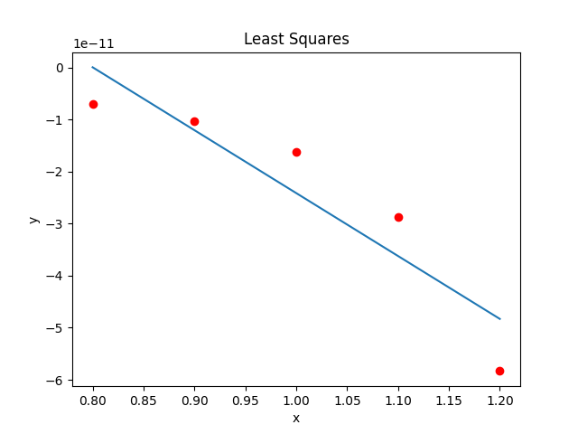

## Least Squares Regression

**Routine Name:** `leastSquares`

**Author**: Kollin Murphy

**Language**: Python3

**Description/Purpose**: The function `leastSquares` approximates the least squares regression line of a set of data points.

#### Usage

The function accepts parameters as follows:

```python
leastSquares(x, y)
```

It returns a tuple of the slope and y-intercept of the least squares regression line.

Example usage:

```python
import matplotlib.pyplot as plt

xs = [0.8, 0.9, 1.0, 1.1, 1.2]
ys = [-7.099792975751029e-12, -1.0309100795247161e-11, -1.6310050532375442e-11, -2.867543702489428e-11, -5.83248588315044e-11]

a, b = leastSquares(xs, ys)
points = [a * x + b for x in xs]
print([a, b])

plt.xlabel('x')
plt.ylabel('y')
plt.plot(xs, ys, 'ro')
plt.plot(xs, points)
plt.show()
```

Example output:

```
[-1.2081646794115365e-10, 9.667261990919927e-11]
```



#### Implementation

```python

def leastSquares(x, y):
  n = len(x)
  a11 = n
  a12 = 0
  a22 = 0
  b1 = 0
  b2 = 0
  for i in range(0, n):
    a12 += x[i]
    a22 += x[i] * x[i]
    b1 += y[i]
    b2 += x[i] * y[i]
  a21 = a12
  detA = (a11 * a22) - (a12 * a21)

  aInv11 = a22 / detA
  aInv21 = -a21 / detA
  aInv22 = a11 / detA

  b = aInv11 * b1 + aInv21 * b2
  a = aInv21 * b1 + aInv22 * b2

  return [a, b]
```
