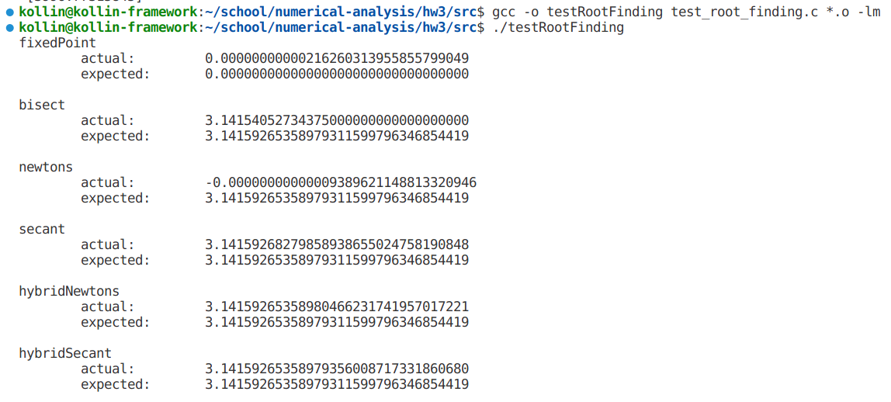
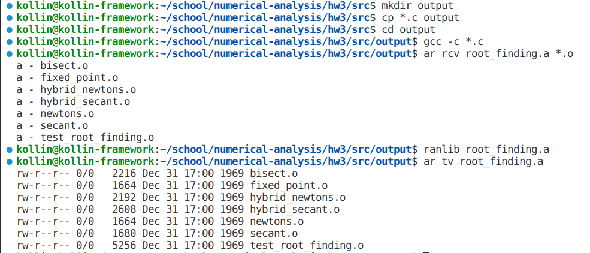
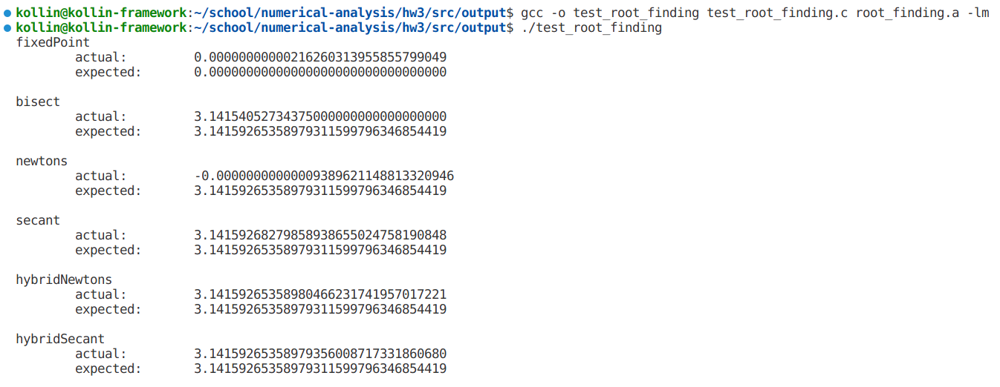

# Tasksheet 3 by Kollin Murphy

## Task 1

I rewrote all six functions in C. View them [here](https://github.com/kollinmurphy/math4610/hw3/src).


## Task 2

I was able to succcessfully pass a function using a function pointer. I got the following results from `newtons`:

```
newtons
        actual:         -0.00000000000009389621148813320946
        expected:       3.14159265358979311599796346854419
```


## Task 3

I was able to link the object files from each function using the command `gcc -o testRootFinding testRootFinding.c *.o -lm`. My results were as follows:




## Task 4

I was able to successfully create a shared library of my code.




## Task 5

I was able to successfully use the shared library to test my code.


