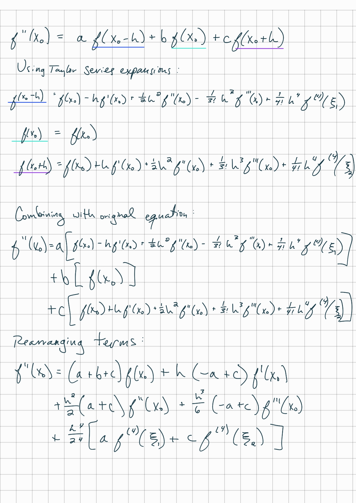
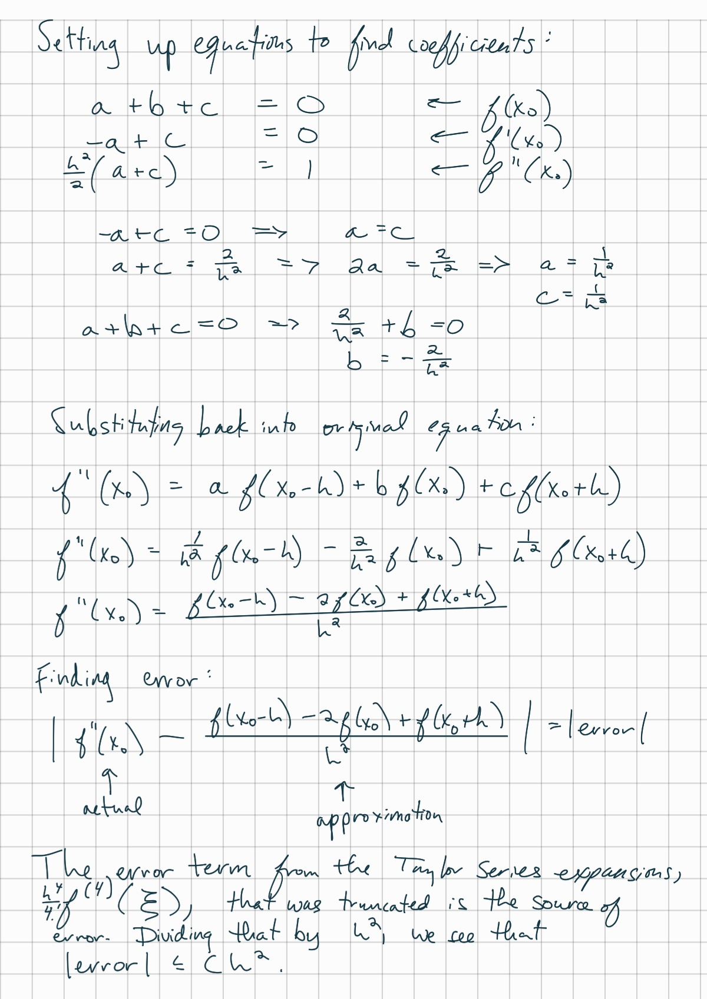
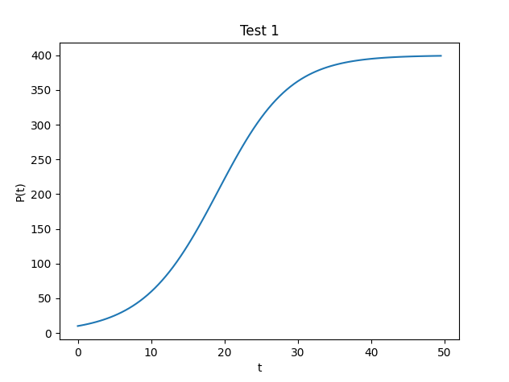
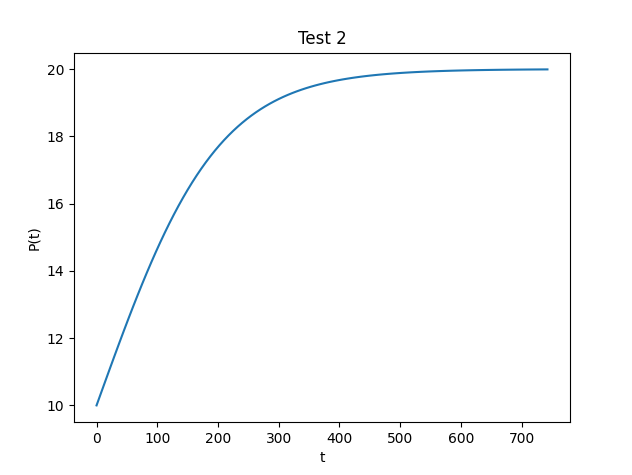
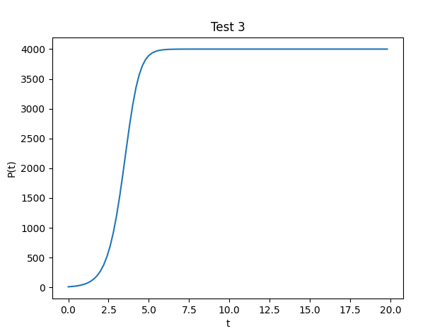

# Tasksheet 4

## Task 1

See attached images below for work.




<div style="page-break-after: always;"></div>
## Task 2

Implementation of second derivative approximation:

```python
def approxSecondDerivative(f, x0, h):
  return f(x0 - h) - 2 * f(x0) + f(x0 + h)
```

Test code:

```python
from math import pi, tan

def testFunction(x):
  return ((x - pi / 2) * tan(x) * tan(x)) / (x * x + 65)

print(f"h = 1 \t\tapprox = \t {approxSecondDerivative(testFunction, pi / 4, 1)}")
print(f"h = 0.1 \tapprox =\t{approxSecondDerivative(testFunction, pi / 4, 0.1)}")
print(f"h = 0.001 \tapprox = \t{approxSecondDerivative(testFunction, pi / 4, 0.001)}")
print(f"h = 0.00001 \tapprox = \t{approxSecondDerivative(testFunction, pi / 4, 0.00001)}")
print(f"h = 0.0000001 \tapprox = \t{approxSecondDerivative(testFunction, pi / 4, 0.0000001)}")
```

Output:

```
h = 1           approx =         0.08888433309385914
h = 0.1         approx =        -0.0006870934574899935
h = 0.001       approx =        -6.767779469826762e-08
h = 0.00001     approx =        -6.767775576066448e-12
h = 0.0000001   approx =        -6.852157730108388e-16
```

<div style="page-break-after: always;"></div>
## Task 3

Implementation of least squares algorithm:

```python
def leastSquares(x, y):
  n = len(x)
  a11 = n
  a12 = 0
  a22 = 0
  b1 = 0
  b2 = 0
  for i in range(0, n):
    a12 += x[i]
    a22 += x[i] * x[i]
    b1 += y[i]
    b2 += x[i] * y[i]
  a21 = a12
  detA = (a11 * a22) - (a12 * a21)

  aInv11 = a22 / detA
  aInv21 = -a21 / detA
  aInv22 = a11 / detA

  b = aInv11 * b1 + aInv21 * b2
  a = aInv21 * b1 + aInv22 * b2

  return [a, b]
```

I used the following code to generate points to pass into the least squares function:

```python
h = 0.00001
xs = [0.8,0.9,1.0,1.1,1.2]
ys = []
for x in xs:
  ys.append(approxSecondDerivative(testFunction, x, h))
print(xs)
print(ys)
```

This produced the points:

```python
xs = [0.8, 0.9, 1.0, 1.1, 1.2]
ys = [-7.099792975751029e-12, -1.0309100795247161e-11, -1.6310050532375442e-11, -2.867543702489428e-11, -5.83248588315044e-11]
```

I then tested the least squares method using this code:

```python
print(leastSquares(xs, ys))
```

Which produced the output:

```
[-1.2081646794115365e-10, 9.667261990919927e-11]
```

<div style="page-break-after: always;"></div>
## Task 4

Implementation:

```c
double absoluteError(double actual, double measured) {
  return actual - measured;
}

double relativeError(double actual, double measured) {
  return absoluteError(actual, measured) / actual;
}
```

I was able to create an archive as follows:

```
gcc -c task4.c
ar rcv errors.a task4.o
ranlib errors.a
```

I ran `ar tv errors.a` to verify that it worked, and my successful output was:

```
rw-r--r-- 0/0   1512 Dec 31 17:00 1969 task4.o
```

<div style="page-break-after: always;"></div>
## Task 5

Implementation:

```python
def explicitEulerLogistic(alpha, beta, p0):
  def f(p):
    return alpha * p - beta * (p * p)

  T = 100
  n = 100
  t0 = 0
  h = (T - t0) / n
  f0 = f(p0)
  tvals = [t0]
  pvals = [p0]

  for i in range(1, n):
    t1 = t0 + h
    p1 = p0 + h * f0
    
    f0 = f(p1)
    t0 = t1
    p0 = p1

    tvals.append(t1)
    pvals.append(p1)
  return (tvals, pvals)
```

For the tests, I varied the value of T to show an appropriate range of the graph.

<div style="page-break-after: always;"></div>
### Test1

$$
\alpha=0.2 \\
\beta=0.0005\\
P_0=10.0 \\
T=50
$$


**Results:**

tvals:

```
[0, 1.0, 2.0, 3.0, 4.0, 5.0, 6.0, 7.0, 8.0, 9.0, 10.0, 11.0, 12.0, 13.0, 14.0, 15.0, 16.0, 17.0, 18.0, 19.0, 20.0, 21.0, 22.0, 23.0, 24.0, 25.0, 26.0, 27.0, 28.0, 29.0, 30.0, 31.0, 32.0, 33.0, 34.0, 35.0, 36.0, 37.0, 38.0, 39.0, 40.0, 41.0, 42.0, 43.0, 44.0, 45.0, 46.0, 47.0, 48.0, 49.0, 50.0, 51.0, 52.0, 53.0, 54.0, 55.0, 56.0, 57.0, 58.0, 59.0, 60.0, 61.0, 62.0, 63.0, 64.0, 65.0, 66.0, 67.0, 68.0, 69.0, 70.0, 71.0, 72.0, 73.0, 74.0, 75.0, 76.0, 77.0, 78.0, 79.0, 80.0, 81.0, 82.0, 83.0, 84.0, 85.0, 86.0, 87.0, 88.0, 89.0, 90.0, 91.0, 92.0, 93.0, 94.0, 95.0, 96.0, 97.0, 98.0, 99.0]
```

pvals:

```
[10, 11.95, 14.268598749999999, 17.02052204485575, 20.27977736848719, 24.130098157126923, 28.664986970016017, 33.98714362502363, 40.20700938413436, 47.4401094591533, 55.80284935823573, 65.40644023163391, 76.34872706607354, 88.70390841698335, 102.51049841615574, 117.75839695662256, 134.37655632105032, 152.22333814090817, 171.08203343170916, 190.66390903648676, 210.62032773924727, 230.56393205860275, 250.09685508716132, 268.8420076423493, 286.47239663423466, 302.7336589444005, 317.4565566043483, 330.5585352596731, 342.03576969509743, 351.9486897586581, 360.4044875989716, 367.5396877780273, 373.50491428764786, 378.4529366466659, 382.5302113477564, 385.8715723204281, 388.597451621994, 390.81295224283883, 392.6081608710249, 394.05920905396556, 395.2297207446402, 396.1723988136251, 396.9305937854791, 397.5397644011284, 398.0287851413018, 398.4210852690319, 398.7356217293617, 398.98769805728375, 399.1896460682154, 399.35138851782494, 399.4809004658325, 399.58458564050284, 399.6675822278572, 399.73401053149814, 399.78717304999986, 399.8297157923446, 399.86375813551996, 399.89099722749313, 399.9127918411923, 399.9302296703224, 399.94418130230844, 399.95534348398326, 399.9642737900844, 399.9714183938865, 399.9771343066551, 399.9817071839041, 399.9853655798097, 399.98829235676465, 399.9906338168773, 399.9925070096391, 399.99400557963884, 399.99520444574455, 399.996163545097, 399.9969308287184, 399.9975446582648, 399.99803572359747, 399.9984285769488, 399.9987428603244, 399.9989942874693, 399.99919542946975, 399.99935634325215, 399.99948507439456, 399.9995880593831, 399.99967044742164, 399.99973635788297, 399.9997890862716, 399.9998312689951, 399.99986501518185, 399.99989201213634, 399.99991360970324, 399.99993088775886, 399.9999447102047, 399.99995576816224, 399.99996461452884, 399.9999716916225, 399.9999773532976, 399.9999818826378, 399.9999855061101, 399.999988404888, 399.9999907239103]
```

Plot:

<div style="page-break-after: always;"></div>
### Test 2

$$
\alpha=0.01 \\
\beta=0.0005\\
P_0=10.0 \\
T=750
$$

**Results:**

tvals:

```
[0, 7.5, 15.0, 22.5, 30.0, 37.5, 45.0, 52.5, 60.0, 67.5, 75.0, 82.5, 90.0, 97.5, 105.0, 112.5, 120.0, 127.5, 135.0, 142.5, 150.0, 157.5, 165.0, 172.5, 180.0, 187.5, 195.0, 202.5, 210.0, 217.5, 225.0, 232.5, 240.0, 247.5, 255.0, 262.5, 270.0, 277.5, 285.0, 292.5, 300.0, 307.5, 315.0, 322.5, 330.0, 337.5, 345.0, 352.5, 360.0, 367.5, 375.0, 382.5, 390.0, 397.5, 405.0, 412.5, 420.0, 427.5, 435.0, 442.5, 450.0, 457.5, 465.0, 472.5, 480.0, 487.5, 495.0, 502.5, 510.0, 517.5, 525.0, 532.5, 540.0, 547.5, 555.0, 562.5, 570.0, 577.5, 585.0, 592.5, 600.0, 607.5, 615.0, 622.5, 630.0, 637.5, 645.0, 652.5, 660.0, 667.5, 675.0, 682.5, 690.0, 697.5, 705.0, 712.5, 720.0, 727.5, 735.0, 742.5]
```

pvals:

```
[10, 10.375, 10.74947265625, 11.12236624651575, 11.492642349048307, 11.85928741961516, 12.221323858207388, 12.577820309395982, 12.927900968592727, 13.270753703285653, 13.605636841582315, 13.931884527707156, 14.24891059293507, 14.556210938334736, 14.853364470404982, 15.14003267034527, 15.415957910899458, 15.68096066055208, 15.934935732951804, 16.177847749873298, 16.409725989295993, 16.63065878707903, 16.840787652264027, 17.040301243376398, 17.22942933738582, 17.408436905344864, 17.57761839016808, 17.73729226341678, 17.887795920031046, 18.029480953245827, 18.16270883682631, 18.287847028495804, 18.405265497116755, 18.515333666827924, 18.618417763862624, 18.71487854604089, 18.805069390769976, 18.889334714608946, 18.968008695852628, 19.041414270969298, 19.10986237589697, 19.173651403992782, 19.23306685368536, 19.288381140468026, 19.339853549678267, 19.387730308442876, 19.432244757152663, 19.473617602807035, 19.512057238491227, 19.547760115084976, 19.580911153027948, 19.61168418356964, 19.64024241040208, 19.66673888390965, 19.69131698147331, 19.71411088834059, 19.735246074524422, 19.754839764031136, 19.773001393448926, 19.789833057562596, 19.80542994020655, 19.81988072903543, 19.833268013288624, 19.845668663959255, 19.857154196057497, 19.867791112889293, 19.87764123246073, 19.886761996271197, 19.895206760880274, 19.903025072728134, 19.910262926761575, 19.91696300947078, 19.923164926978735, 19.928905418848657, 19.934218558287, 19.939135939422698, 19.943686852338985, 19.947898446523812, 19.951795883389995, 19.955402478497525, 19.958739834089247, 19.961827962527714, 19.964685401196466, 19.967329319403397, 19.969775617798003, 19.972039020788355, 19.974133162417886, 19.97607066613672, 19.977863218877644, 19.979521639822778, 19.981055944223936, 19.982475402617457, 19.983788595752973, 19.985003465535396, 19.98612736226007, 19.987167088402774, 19.98812893920899, 19.9890187403105, 19.98984188258197, 19.990603354435763]
```

Plot:

<div style="page-break-after: always;"></div>
### Test 3

$$
\alpha=2.0 \\
\beta=0.0005\\
P_0=10.0 \\
T=20
$$

tvals:

```
[0, 0.2, 0.4, 0.6000000000000001, 0.8, 1.0, 1.2, 1.4, 1.5999999999999999, 1.7999999999999998, 1.9999999999999998, 2.1999999999999997, 2.4, 2.6, 2.8000000000000003, 3.0000000000000004, 3.2000000000000006, 3.400000000000001, 3.600000000000001, 3.800000000000001, 4.000000000000001, 4.200000000000001, 4.400000000000001, 4.600000000000001, 4.800000000000002, 5.000000000000002, 5.200000000000002, 5.400000000000002, 5.600000000000002, 5.8000000000000025, 6.000000000000003, 6.200000000000003, 6.400000000000003, 6.600000000000003, 6.800000000000003, 7.0000000000000036, 7.200000000000004, 7.400000000000004, 7.600000000000004, 7.800000000000004, 8.000000000000004, 8.200000000000003, 8.400000000000002, 8.600000000000001, 8.8, 9.0, 9.2, 9.399999999999999, 9.599999999999998, 9.799999999999997, 9.999999999999996, 10.199999999999996, 10.399999999999995, 10.599999999999994, 10.799999999999994, 10.999999999999993, 11.199999999999992, 11.399999999999991, 11.59999999999999, 11.79999999999999, 11.99999999999999, 12.199999999999989, 12.399999999999988, 12.599999999999987, 12.799999999999986, 12.999999999999986, 13.199999999999985, 13.399999999999984, 13.599999999999984, 13.799999999999983, 13.999999999999982, 14.199999999999982, 14.39999999999998, 14.59999999999998, 14.79999999999998, 14.999999999999979, 15.199999999999978, 15.399999999999977, 15.599999999999977, 15.799999999999976, 15.999999999999975, 16.199999999999974, 16.399999999999974, 16.599999999999973, 16.799999999999972, 16.99999999999997, 17.19999999999997, 17.39999999999997, 17.59999999999997, 17.79999999999997, 17.999999999999968, 18.199999999999967, 18.399999999999967, 18.599999999999966, 18.799999999999965, 18.999999999999964, 19.199999999999964, 19.399999999999963, 19.599999999999962, 19.79999999999996]
```

pvals:

```
[10, 13.99, 19.56642799, 27.354714675571216, 38.22177250430151, 53.364391116685056, 74.42537173943363, 103.6416068393518, 144.02409130826823, 199.55943394385827, 275.40081075380226, 377.976574398938, 514.8805750790776, 694.3226044513325, 923.8432583266574, 1208.031925061759, 1545.3105818896206, 1924.636335195465, 2324.068366998188, 2713.566336349301, 3062.6486447122047, 3349.7264305013364, 3567.550286781948, 3721.8288966229316, 3825.3594216983574, 3892.165719860061, 3934.1366087187066, 3960.0481666001165, 3975.8692850608686, 3985.463341896174, 3991.2568736948215, 3994.746479991134, 3996.845128047432, 3998.1060815067553, 3998.8632902113272, 3999.317844915882, 3999.590660415973, 3999.754379493694, 3999.852621663273, 3999.9115708259264, 3999.946941713584, 3999.968164746632, 3999.980898746631, 3999.9885392114925, 3999.9931235137606, 3999.9958741035275, 3999.9975244604143, 3999.9985146756358, 3999.9991088051606, 3999.999465283017, 3999.9996791697818, 3999.999807501859, 3999.999884501112, 3999.9999307006656, 3999.999958420399, 3999.999975052239, 3999.999985031343, 3999.9999910188058, 3999.9999946112835, 3999.99999676677, 3999.999998060062, 3999.9999988360373, 3999.999999301622, 3999.9999995809735, 3999.9999997485843, 3999.9999998491508, 3999.9999999094903, 3999.999999945694, 3999.9999999674164, 3999.9999999804495, 3999.99999998827, 3999.999999992962, 3999.999999995777, 3999.999999997466, 3999.99999999848, 3999.999999999088, 3999.9999999994525, 3999.9999999996717, 3999.999999999803, 3999.9999999998818, 3999.999999999929, 3999.9999999999573, 3999.9999999999745, 3999.9999999999845, 3999.9999999999905, 3999.999999999994, 3999.9999999999964, 3999.9999999999977, 3999.9999999999986, 3999.999999999999, 3999.9999999999995, 3999.9999999999995, 3999.9999999999995, 3999.9999999999995, 3999.9999999999995, 3999.9999999999995, 3999.9999999999995, 3999.9999999999995, 3999.9999999999995, 3999.9999999999995]
```

Plot:
