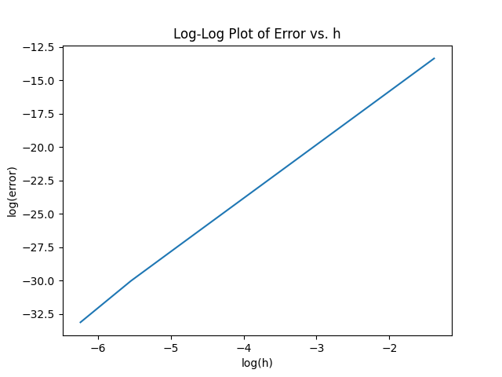

# Tasksheet 5 by Kollin Murphy

## Task 1

I implemented the Implicit Euler Method to solve the logistics equation. I used the following code to solve the logistics equation:

```python
def implicitEulerMethod(alpha, beta, p0, n=100, h=1.0):
  """Solve the logistic equation using the implicit Euler method."""

  def fPrime(p):
    return 1 - alpha * h + 2 * h * beta * p

  ptable = [0 for i in range(n)]
  ptable[0] = p0
  for i in range(1,n):
    def f(p):
      return p - ptable[i - 1] - h * (alpha * p - beta * p * p)
    pval = newtons(f, fPrime, ptable[i - 1], 100, 1e-6)
    ptable[i] = pval
  return [[i*h, ptable[i]] for i in range(n)]
```

I used the following code to test and plot the results, and save the plots as individual files.

```python
tests = [
  [0.2, 0.0005, 10.0, 75, 1.0, "Test 1", "task1-test1.png"],
  [0.01, 0.0005, 10.0, 350, 2.0, "Test 2", "task1-test2.png"],
  [2.0, 0.0005, 10.0, 75, 0.1, "Test 3", "task1-test3.png"],
]

for test in tests:
  tvals, pvals = zip(*implicitEulerMethod(test[0], test[1], test[2], test[3], test[4]))
  plt.title(test[5])
  plt.xlabel('t')
  plt.ylabel('P(t)')
  plt.plot(tvals, pvals)
  plt.savefig(test[6])
  plt.clf()
```

These are my results:

**Test 1.** I used the following parameters: alpha = 0.2, beta = 0.0005, p0 = 10.0, n = 75, h = 1.0. This is the plot:


**Test 2.** I used the following parameters: alpha = 0.01, beta = 0.0005, p0 = 10.0, n = 350, h = 2.0. This is the plot:


**Test 3.** I used the following parameters: alpha = 2.0, beta = 0.0005, p0 = 10.0, n = 75, h = 0.1. This is the plot:


## Task 2

The given differential equation is:
$$
\begin{align*}
\frac{dP}{dt} &= \alpha P - \beta P^2
\end{align*}
$$
Below is a complete analytic solution to the differential equation.
$$
\begin{align*}
\frac{dP}{dt} &= \alpha P - \beta P^2 \\
dP &= (\alpha P - \beta P^2)\;dt \\
dt &= \frac{dP}{\alpha P - \beta P^2} \\
\int 1 \;dt &=\int \frac{1}{\alpha  P - \beta P^2}\;dP \\
t+C &= \int \frac{1}{P^2(\frac {\alpha}{P}  - \beta)}\;dP
\end{align*}
$$
By using u-substitution, we are able to solve this integral.
$$
\begin{align*}
u &= \frac{\alpha}{P} - \beta \\
du &=-\alpha P^{-2}\;dP
\end{align*}
$$
Substituting this into the integral, we get:
$$
\begin{align*}
\int \frac{1}{P^2(\frac {\alpha}{P}  - \beta)}\;dP &= \int -\frac{1}{\alpha u}\;du \\
&=-\frac{1}{\alpha}\ln|u|+C \\
&= -\frac{\ln|\frac{\alpha}{P} - \beta |}{\alpha} + C
\end{align*}
$$
Therefore,
$$
\begin{align*}
t &= -\frac{\ln|\frac{\alpha}{P} - \beta |}{\alpha} + C
\end{align*}
$$


## Task 3


## Task 4

I implemented the trapezoid rule using Python. I used the following code to implement the trapezoid rule:

```python
def trapezoidRule(f, a, b, n):
  h = (b - a) / n
  sum = 0.5 * (f(a) + f(b))
  for i in range(1, n):
    sum += f(a + i * h)
  return sum * h
```

I tested the trapezoid rule by using the following code:

```python
from math import e, pow, pi

tests = [2, 4, 8, 16, 100000]

def f(x):
  return pow(e, -x * x)

for test in tests:
  print(f"n={test}; approx={trapezoidRule(f, 0, pi / 4, test)}")
```

The output of the test code is:

```
n=2; approx=0.6388862805734845
n=4; approx=0.6471507696813964
n=8; approx=0.6491991053630145
n=16; approx=0.6497100964398593
n=10000; approx=0.6498803296429212
```

It appears that the sequence is converging to a value of approximately `0.64988`. This is the correct value of the integral of `e^(-x^2)` from `0` to `pi / 4`.

## Task 5

I implemented the Simpson's rule using Python. I used the following code to implement the Simpson's rule:

```python
def simpsonsRule(f, a, b, n):
  h = (b - a) / n
  x = a
  sum = 0
  for i in range(n):
    sum += f(x) + 4 * f(x + h / 2) + f(x + h)
    x += h
  return sum * h / 6
```

I tested my implementation with the following code:

```python
from math import e, pow, pi

tests = [2, 4, 8, 16, 100000]

def f(x):
  return pow(e, -x * x)

for test in tests:
  print(f"n={test}; approx={simpsonsRule(f, 0, pi / 4, test)}")
```

The output of the test code is:

```
n=2; approx=0.6499055993840338
n=4; approx=0.6498818839235537
n=8; approx=0.6498804267988076
n=16; approx=0.6498803361175072
n=100000; approx=0.6498803300785783
```

It appears that the sequence is converging to a value of approximately `0.64988`. This is the correct value of the integral of `e^(-x^2)` from `0` to `pi / 4`. Using Wolfram Alpha, I found that the exact value of the integral is `0.6498803300786573037276521829129935239240253152760926685227030955`. This is very close to the value I found using Simpson's rule. I used this value to perform a convergence analysis on my code. I used the following code to perform the convergence analysis:

```python
def calculateNFromH(a, b, h):
  return (b - a) / h

hvals = [1/4, 1/8, 1/16, 1/32, 1/64, 1/128, 1/256, 1/512, 1/1024, 1/2048, 1/4196]
nvals = [int(calculateNFromH(0, 1, h)) for h in hvals]

# I calculated the actual value of the integral using Wolfram Alpha
actual = 0.6498803300786573037276521829129935239240253152760926685227030955

def f(x):
  return pow(e, -x * x)

approximations = [simpsonsRule(f, 0, pi / 4, n) for n in nvals]
errors = [abs(actual - approximation) for approximation in approximations]

plt.plot([log(h) for h in hvals], [log(error) for error in errors])
plt.title("Log-Log Plot of Error vs. h")
plt.xlabel("log(h)")
plt.ylabel("log(error)")
plt.savefig("task5.png")
plt.show()
```

The resulting plot is:



As can be seen in the plot, as the value of h decreased, the accuracy increased until a certain point at which the accuracy stopped increasing and actually decreased due to floating point errors.

The values returned from the test code are:

```
h              | approx         | error
------------------------------------------------
2.50000000e-01 | 6.49881884e-01 | 1.55384490e-06
1.25000000e-01 | 6.49880427e-01 | 9.67201503e-08
6.25000000e-02 | 6.49880336e-01 | 6.03884986e-09
3.12500000e-02 | 6.49880330e-01 | 3.77331721e-10
1.56250000e-02 | 6.49880330e-01 | 2.35813591e-11
7.81250000e-03 | 6.49880330e-01 | 1.47415413e-12
3.90625000e-03 | 6.49880330e-01 | 9.24815780e-14
1.95312500e-03 | 6.49880330e-01 | 5.10702591e-15
9.76562500e-04 | 6.49880330e-01 | 9.99200722e-16
4.88281250e-04 | 6.49880330e-01 | 8.88178420e-16
2.38322212e-04 | 6.49880330e-01 | 9.99200722e-15
```

When `h` was cut in half, the accuracy of the approximation increased by a factor of 16. This is because the number of intervals was doubled. This is consistent with the convergence rate of Simpson's rule, which is `O(h^4)`. This means that the error is proportional to `h^4`.
